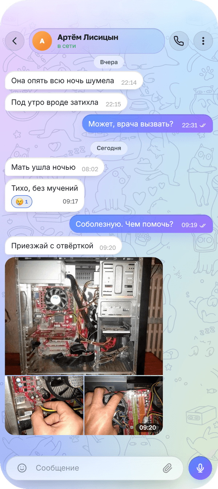
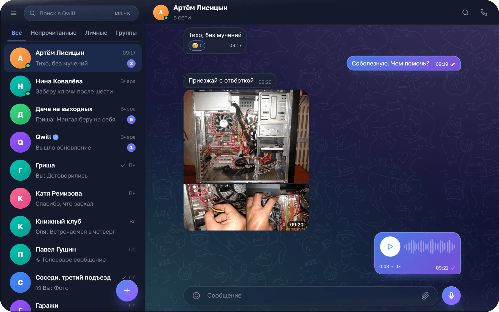

<div align="center">


# Qwill

**Мессенджер для общения. Просто будь на связи.**

Android · Windows · браузер


### [Посмотреть и скачать →](https://qwill.mooo.com/download)

На странице загрузки работает живое демо приложения: его можно полистать до установки.

<br>


&nbsp;&nbsp;


</div>

## Возможности

### Переписка
- Ответы, пересылка, правка и удаление, выбор нескольких сообщений сразу
- Реакции из меню сообщения и двойным тапом, реакцию по умолчанию можно сменить
- Закреплённые чаты, фильтры списка: непрочитанные, личные, группы
- Поиск по сообщениям внутри чата и переход к нужной дате по календарю

### Медиа и голосовые
- Фото и видео отправляются альбомами, в чате раскладываются мозаикой
- Файлы любого типа, большие грузятся кусками и докачиваются после обрыва
- Голосовые сообщения с волной и ускорением воспроизведения
- Вкладки «Медиа», «Файлы», «Ссылки», «Голосовые» в информации о чате, превью ссылок

### Звонки
- Аудио- и видеозвонки, личные и групповые
- Демонстрация экрана и картинка-в-картинке
- Ответили на одном устройстве — на остальных вызов гаснет

### Группы, люди, профиль
- Группы с участниками и ролями
- Единый поиск: чаты и люди в одном поле
- Своя визитка профиля и приглашение по QR-коду
- Блокировка пользователей и жалобы

### Оформление
- Светлая и тёмная темы в фиолетовой палитре, по умолчанию — как в системе
- Обои чата с собственным узором
- Жесты как в мобильных мессенджерах: свайп назад, долгое нажатие, двойной тап

### Платформы и офлайн
- Android, Windows и браузер, один аккаунт на всех устройствах
- Push-уведомления, в том числе когда приложение закрыто
- Кэш переписок: открытые чаты читаются и без сети
- На компьютере — три колонки, горячие клавиши и контекстные меню

## Для разработчиков

Монорепо на TypeScript: Express 5 · Prisma · Socket.io · React 19 · Vite · Zustand ·
CSS Modules · Zod · Vitest · Playwright. Звонки — через LiveKit, Android — Capacitor,
Windows — Electron.

### Структура

```
qwill/
├─ shared/    общие типы: DTO, контракты socket-событий, Zod-схемы
├─ server/    Express 5, Socket.io, Prisma, сервисы бизнес-логики
├─ client/    Vite + React 19, мобильный интерфейс первичен; обёртка Android в client/android
├─ desktop/   оболочка Electron для Windows
├─ e2e/       сценарии Playwright
├─ deploy/    конфигурации для выкладки на сервер
└─ docker-compose.yml    Postgres для локальной разработки
```

### Запуск

Нужен Node ≥ 22.12 и Postgres 16+.

```bash
npm install
cp .env.example .env        # затем заполнить DATABASE_URL и JWT_SECRET
npm run db:migrate          # применить схему
npm run dev                 # http://localhost:5173 (клиент) + http://localhost:3000 (API)
```

Если Postgres не установлен локально, его можно поднять в Docker:

```bash
npm run db:up
```

### Скрипты

| Команда | Что делает |
|---|---|
| `npm run dev` | shared в watch-режиме + сервер (`node --watch`) + клиент (Vite) |
| `npm run build` | сборка shared, server и client |
| `npm run typecheck` | `tsc --noEmit` по всем пакетам |
| `npm run lint` | ESLint |
| `npm test` | Vitest |
| `npm run test:e2e` | Playwright |
| `npm run test:e2e:offline` | офлайн-сценарии на продакшен-сборке клиента |
| `npm run desktop` | сборка и запуск десктопного приложения |
| `npm run desktop:dist` | установщик для Windows |
| `npm run db:migrate` | `prisma migrate dev` |
| `npm run db:studio` | Prisma Studio |

### Переменные окружения

Один `.env` в корне — его читают и сервер (через `server/src/config/env.ts`), и Vite.
Схема и значения по умолчанию описаны в `.env.example`; при некорректном значении
сервер падает на старте, а не в рантайме.

## Лицензия

[GNU AGPL v3.0](LICENSE)
